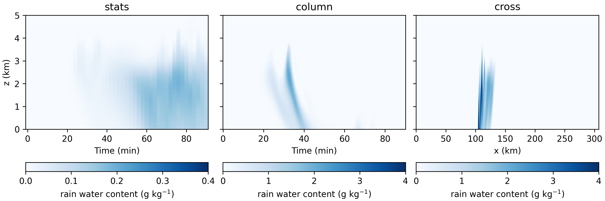

Overview
===============================

.. toctree::
   :maxdepth: 2
   :caption: Contents:


Simulation settings
---------------------

The decision tree below provides an overview of the main available options in the model.
Note that many more (detailed) options are available.
Therefore, it is advised to check out the complete list of the options in :ref:`ini-file-label` for the classes included in your simulation.

For any simulation, the grid and time settings have to be specified (:ref:`Grid ``[Grid]``` and :ref:`Timeloop ``[Time]```),
as well as the viscosity (:ref:`Fields ``[Fields]``` ``visc`` and ``svisc``).
Hence these are not included in the scheme below.

|

.. image:: flowchart.jpeg
    :width: 800

|


Output
------------

In addition to the classes in the decision tree there are classes that control the output settings.
These are:

1. domain average statistics: :ref:`Statistics ``[Stats]```

2. single column output: :ref:`Column ``[Column]```

3. cross sections: :ref:`Cross sections ``[Cross]```

4. 3D field dumps: :ref:`Dump of 3D fields ``[Dump]```

5. budgets of the second order moments: :ref:`Budget statistics ``[budget]```


.. admonition:: Example
    :class: tip

    The figure below shows examples of different output types (domain average statistics, single columns, and cross sections).
    The figure shows rain water content in the the Weisman Klemp case. More examples from this case are shown in :ref:`ini-file-label`.
    On the left, the domain average values.
    In the center, the values in a column, which is located at half the y domain size and 1/3 the x domain size.
    On the right, the values in a xz cross section located at half the y domain size for time = 60 minutes.



|

.. note::
    | How to convert cross-sections and 3D dump to netCDF is described in :ref:`Merging statistics`.
    | Options for masked statistics are described in :ref:`Masked statistics`.
