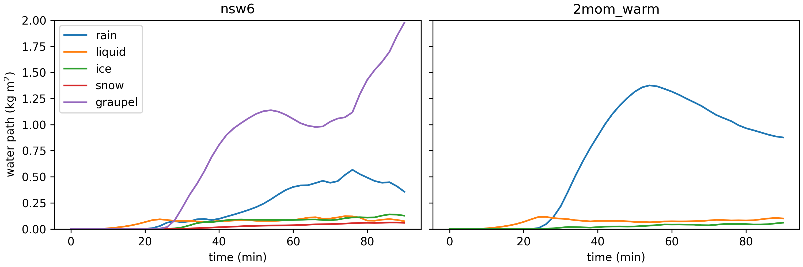
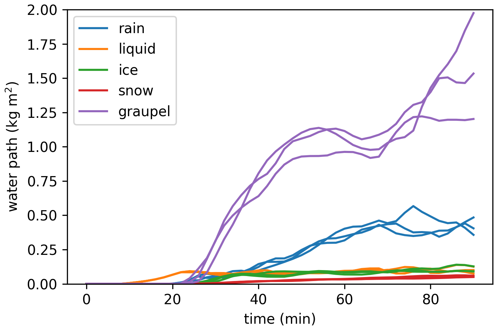
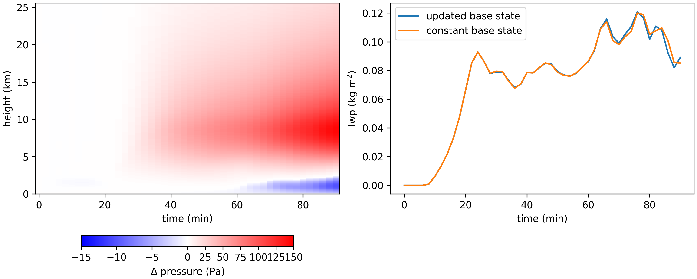

Idealized simulations: beyond the drycblles
=============================================

.. toctree::
   :maxdepth: 2
   :caption: Contents:


In :ref:`Running your first case` you ran an LES of a dry convective boundary layer.
In this tutorial we will explore the building bloks of such a simulation, such as advection and diffusion and the different options that are availabel (for LES).

This tutorial contains examples from the Weisman Klemp case (`Weisman and Klemp (1982)`_)
This is a case of an idealized convetive storm, which is initiated by releasing a warm bubble close to the surface.
A video of a MicroHH simulation of this bubble can be found here: https://vimeo.com/901517622.
For most examples, the y-dimension was reduced to one grid cell, to create a 2D simulation.

.. _Weisman and Klemp (1982): https://doi.org/10.1175/1520-0493(1982)110<0504:TDONSC>2.0.CO;2

.. note::
    Here we show examples of commonly used options and their impact, to help you choose suitable settings for your own simulations.
    However, what the most suitable settings are depends on the case.
    Apart from looking at the examples here, you can base your choises on the available example cases or test the sensitivity of your own case yourself.


Advection
-----------------
The different advection schemes in MicroHH differ in their order of the interpolations.
In general, higher order schemes are more accurate, but also come at higher costs.
The odd ordered schemes have hyperdiffusion included and the ``2i5`` and ``2i62`` schemes have the possibility to provide a list of the scalars for which monotonic advection is guaranteed.
Both the hyperdiffusion and the flux limiters dampen the variance and smooth out sharp gradients.
In some cases, e.g. when using a coarse resolution, this can be advantagous.
However, in other cases, it can hamper the existence of small scale structures and result in overly smooth fields.

.. admonition:: Example
    :class: tip

    The plot below shows xz cross sections after half an hour of the concentration of a passive scalar that was added to the warm bubble for different advection scheme and two resolutions.


More information about the second order scheme can be found in `Wicker and Skamarock (2002)`_.

.. _Wicker and Skamarock (2002): https://doi.org/10.1175/1520-0493(2002)130<2088:TSMFEM>2.0.CO;2


Microphysics
-------------
For the microphysics, two schemes are available.
One is a single moment scheme (``swmicro=nsw6``, `Tomita (2008)`_), which in short means that the scheme predics only the mixing ratios of the hydrometeors.
The other is a double moment scheme (``swmicro=2mom_warm``, `Seifert and Beheng (2006)`_), which means that the scheme predics the mixing ratios and number concentrations of the hydrometeors.
Note that ``swmicro=2mom_warm`` does not include ice processes, only ice created by the saturation adjustment, and the cloud droplet number is fixed.

.. admonition:: Example
    :class: tip

    The figure below shows time series of water paths of hydrometeors in the 2D Weisman-Klemp bubble.
    (For the simulations in this plot we used :code:`swadvec=2i5` and a horizontal resolution of 600 m.)




.. note::
    The most visible difference between the schemes is currently the lack of snow and graupel in the double moment scheme.
    This will change once the complete double moment scheme is available.


.. note::
    Both schemes currently require specifying the cloud droplet number concentration.
    The typical order of magnitude for :code:`Nc0` is 10-1000 cm\ :sup:`-3`, ranging from clean to polluted air, and the input value must be m\ :sup:`-3`.

.. _Tomita (2008):  https://doi.org/10.2151/jmsj.86A.121
.. _Seifert and Beheng (2006): https://doi.org/10.1007/s00703-005-0112-4

..
    based on this, one would wonder why use the double moment scheme?

Buffer
-------
The buffer layer is a layer at the top of the domain that prevents the reflection of gravity waves back into the domain.
The buffer layer should be thick enough and the buffer strong enough to dampen the gravity waves before they reach the top of the domain.
At the same time, a too strong buffer or starting the buffer at a too low level can hamper the convection below the buffer layer.

The strength of the buffer layer can be estimated with :math:`N / (2 \pi)`,
where N is the Brunt-Vaisala frequency :math:`N = sqrt((g\ \Delta \theta_v) / (\theta_v\ \Delta z))`.

.. admonition:: Example
    :class: tip

    For the Weisman Klemp bubble, we roughly estimate the buffer strength for the layer between 20 and 25 km as sqrt((10 * 140)/(570 * 5000))/(2 * pi), which is roughly 0.0035.

    The figure below shows the domain mean vertical velocity variance avaraged between 1 and 1.5 hours.
    The line show different combinations of buffer strength and height. The buffer height is also indicated by the dashed lines.
    (For the simulations in this plot we used `swadvec=2i5` and a horizontal resolution of 600 m.)


Fields: random perturbations
------------------------------
The fields class contains the settings that control the generation of the random perturbation in the initialization.
These perturbations are required to generate turbulent structures.
By rerunning a simulation with different random seeds, an ensamble can be formed.

.. admonition:: Example
    :class: tip

    The figure below shows the water paths like in the example for the microphysics with :code:`swmicro=nsw6`.
    The individual lines are repetitions of the same simulation with rndseed = 1, 2, and 3, respectivelly.



.. note::
    In most cases, the random perturbations are applied in the model simulation, controlled by the settings in :ref:`Fields ``[fields]```.
    The Weisman Klemp bubble show here is an exceptional case, for which the random perturbations are applied together with the warm bubble in a seperate python script.


Thermodynamics
----------------
| In the thermodynamics there are two main choices:
| 1. :code:`swthermo`. The most used options here are ``swthermo=moist`` for simulations that include mositure, and ``swthermo=dry`` for dry cases.
| 2. :code:`swbasestate`. Both moist and dry thermodynamics require specifying the approximation for the base state. There are two options:
| - the anelastic approximation. Under this approximation, the state variables density, pressure, and temperature are described as small fluctuations
    from corresponding vertical reference profiles that are functions of height only.
| - the Boussinesq approximation, which is the same as the anelastic approximation with the additional assumption that the density is always 1.

.. note::
    When using the anelastic approximation, the base state used for the moist thermodynamics can optionally be taken constant (``swupdatebasestate=false``).
    The impact of this setting depends on how strongly your domain average profiles change over time.

.. admonition:: Example
    :class: tip

    In cases where the domain avergage state rapidly changes over time, such as the Weisman Klemp bubble,
    the choice of a constant or updating base state influences the tendencies.
    Namely the buoyancy tendency, which depends directly on the difference between the base state virtual potential temperature and the actual virtual potential temperature.

    The figure below shows vertical profiles of the buoyancy driven tendency in the vertical velocity after 1.5 hours.
    (For the simulations in this plot we used :code:`swadvec=2i5` and a horizontal resolution of 600 m.)




..
    Diffusion
    ------------

    Our BOMEX case (and also the drycblles) use a 2nd order Smagorinsky scheme for the diffusion.
    This scheme (with the default values for the Smagorinsky constant (``cs``) and turbulent Prandtl number (``tPr``)) is used in most example LES cases, and is generally speeking a good choice.
    All additional settings and alternative options are listed under :ref:`Diffusion ``[diff]```

    .. note::
        By default, MicroHH uses an adaptive time step. In some cases when a simulation crashes, it can help to enforce a shorter timestep,
        which you can obtain by using stricter settings for the :code:`cflmax` in the :code:`advection` group and the :code:`dnmax` in the :code:`diffusion` group.


    do one with tke2: what to show?

