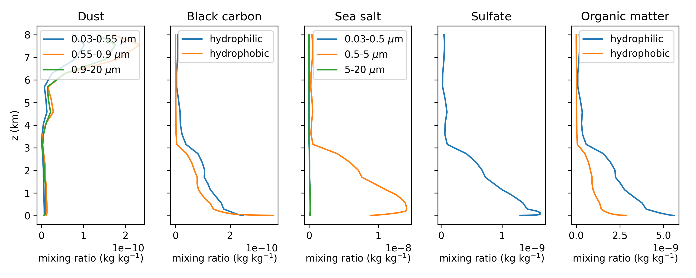
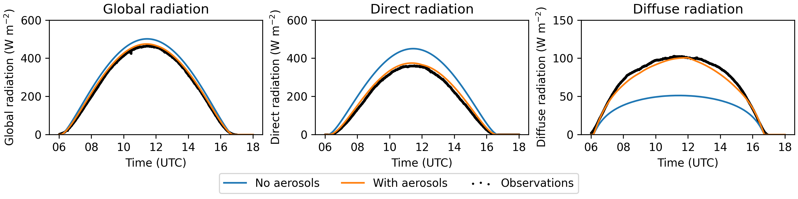
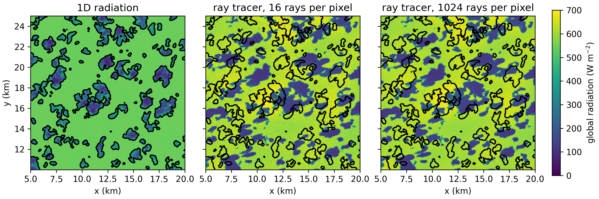

Realistic LES: the cabauw case
===========================================

.. toctree::
   :maxdepth: 2
   :caption: Contents:


Generating input data using (LS) :sup:`2` D
----------------------------------------------

Download the data
......................

To generate input based on ERA5, the (LS) :sup:`2` D python package can be used.
General instructions on (LS) :sup:`2` D can be found here: https://github.com/LS2D/LS2D and
a more elaborate description is given in the reference paper (`van Stratum et al., 2023`_).
ERA5 is described in `Hersbach et al., (2020)`_ and CAMS in `Inness et al (2019)`_.
This tutorial shortly describes the steps to take and where to find the relevant scripts and functions.

.. _van Stratum et al., 2023: https://doi.org/10.1029/2023MS003750
.. _Hersbach et al., (2020): https://doi.org/10.1002/qj.3803
.. _Inness et al (2019): https://doi.org/10.5194/acp-19-3515-2019

| 1. Download the ERA5 (and CAMS) data.
|   This is done with the ``download_era5`` function (and the ``download_cams`` function). If the requested data is not done before, these functions submit a request to the ECMWF system and close after submitting the request. Hence, you have to call this function a second time once the request is completed to download the data.
| 2. Read the data.
|   This is done with the ``Read_era5`` class (and the ``Read_cams`` class). For the ERA5 data, this class also calculates some derived quantities such as thl.
| 3. Calculate large scale forcings.
|   This is done with the ``calculate_forcings`` function from the ``Read_era5`` class that was called under step 2.
| 4. Interpolate the ERA5 and CAMS data to the MicroHH grid
|   This can be done with the ``get_les_input`` function from the ``Read_era5`` class that was called under step 2 (and the ``get_les_input`` function from the ``Read_cams`` class).
| 5. Save the input variables to NetCDF.

| Examples of python scripts that follow these steps are available.
| For ERA5: https://github.com/LS2D/LS2D/blob/main/examples/example_era5.py
| For CAMS: https://github.com/LS2D/LS2D/blob/main/examples/example_cams.py

.. admonition:: Example
    :class: tip

    The plot below shows vertical profiles taken and derived from ERA5 using example_era5.py. This example shows 13 UTC on 4 July 2016.


.. admonition:: Example
    :class: tip

    The plot below shows vertical profiles of aerosols mass mixing ratios taken from CAMS using example_cams.py. This example shows 13 UTC on 4 July 2016.




.. note::

    1. When using CDS and ADS the :code:`$HOME/.cdsapirc` file must contain the url and key for CDS as :code:`url` and :code:`key` and for ADS as :code:`url_ads` and :code:`key_ads`.
    2. In :code:`example_cams.py` and :code:`example_era5.py` specify your own directories.
    3. Optionally, specify your own date, time and location in the settings dictionary in :code:`example_cams.py` and :code:`example_era5.py`.
    4. :code:`example_cams.py` and :code:`example_era5.py` stop after the download requests are submitted. Run them again once the data is downloaded to obtain the derived data.
    5. Optionally, adapt the domain height in :code:`example_cams.py` and :code:`example_era5.py` to be larger than the desired domain height of the MicroHH simulation.


Creating input for MicroHH
............................

The obtained files (``ls2d_era5.nc`` and ``ls2d_cams.nc``) can now be used to generate a ``yourcase_input.nc`` file.
An example script to do this is available in ``/cases/cabauw/cabauw_input.py``

The ``cabauw_input.py`` is a very complete script that allows to set many options that are discussed in the rest of this tutorial.
It does not only produce ``cabauw_input.nc``, it also produces ``cabauw.ini`` from ``cabauw.ini.base``.
Hence all the switches are set automatically, based on the flags given in ``cabauw_input.py``.
The code snippet below shows the part of ``cabauw_input.py`` where the flags are set.

.. code-block:: python

    """
    Case switches.
    """
    TF = np.float64              # Switch between double (float64) and single (float32) precision.
    use_htessel = True           # False = prescribed surface H+LE fluxes from ERA5.
    use_rrtmgp = True            # False = prescribed surface radiation from ERA5.
    use_rt = False               # False = 2stream solver for shortwave down, True = raytracer.
    use_homogeneous_z0 = True    # False = checkerboard pattern roughness lengths.
    use_homogeneous_ls = True    # False = checkerboard pattern (some...) land-surface fields.
    use_aerosols = False         # False = no aerosols in RRTMGP.
    use_tdep_aerosols = False    # False = time fixed RRTMGP aerosol in domain and background.
    use_tdep_gasses = False      # False = time fixed ERA5 (o3) and CAMS (co2, ch4) gasses.
    use_tdep_background = False  # False = time fixed RRTMGP T/h2o/o3 background profiles.

    sw_micro = '2mom_warm'

    """
    NOTE: `use_tdep_aerosols` and `use_tdep_gasses` specify whether the aerosols and gasses
          used by RRTMGP are updated inside the LES domain. If `use_tdep_background` is true, the
          aerosols, gasses, and the temperature & humidity are also updated on the RRTMGP background levels.
    """

    # Switch between the two default RRTMGP g-point sets.
    gpt_set = '128_112' # or '256_224'

    # Time period.
    # NOTE: Included ERA5/CAMS data is limited to 2016-08-15 06:00 - 18:00 UTC.
    start_date = datetime(year=2016, month=8, day=15, hour=6)
    end_date   = datetime(year=2016, month=8, day=15, hour=18)

    # Simple equidistant grid.
    zsize = 4000
    ktot = 160

    itot = 512
    jtot = 512

    xsize = 25600
    ysize = 25600


| In this part of the script, you can specify:
| - the precision (``TF``)
| - the start and end date/time (``start_date``, ``end_date``)
| - the domain size (``zsize``, ``xsize``, ``y_size``)
| - the number of grid points (``ktot``, ``itot``, ``jtot``)
| - settings regarding the land surface model (``use_htessel``, ``use_homogeneous_z0``, ``use_homogeneous_ls``) as discussed below (:ref:`Land surface`)
| - setting regarding the radiation (``use_rrtmgp``, ``use_rt``, ``use_aerosols``, ``use_tdep_aerosols``, ``use_tdep_gasses``, ``use_tdep_background``) as discussed below (:ref:`Radiation`)
| - the microphysics scheme as discussed for the idealized cases (:ref:`Microphysics`)

.. note::
    1. in cabauw_input.py, the filenames for the ERA5 and CAMS data must be specified.
    2. currently, cabauw_input.py requires a file with the CAMS data, also if this data is not used.

.. note::
    | When running cabauw_input.py outside of the microhh directory be aware of the following:
    | 1. ``cabauw.ini.base`` and ``microhh_tools.py`` must be present in the working directory.
    | 2. the paths to the required lookup tables must be specified.


Large scale forcings
-----------------------
Our Cabauw simulation includes :ref:`Large-scale forcings ``[force]``` based on ERA5.
This includes the following aspects and their settings in ``cabauw.ini`` and ``cabauw_input.nc``:

| 1. A large scale pressure force, derived from the time dependent geostropic wind and the coriolis parameter.
|     ``cabauw.ini``: ``swlspres=geo``, ``swtimedep_geo=true`` and ``fc=0.000115``.
|     ``cabauw_input.nc``: profiles of the geostropic wind (u and v) in the ``timedep`` group.
| 2. Time dependent large scale advection of thl, qt, u and v.
|     ``cabauw.ini``: ``swls=1``, ``swtimedep_ls=true``, ``lslist=thl,qt,u,v`` and ``timedeplist_ls=thl,qt,u,v``.
|     ``cabauw_input.nc``: profiles of thl_ls, qt_ls, u_ls and v_ls in the ``timedep`` group.
| 3. Time dependent large scale subsidence based on the local field.
|     ``cabauw.ini``: ``swwls=local`` and ``swtimedep_wls=true``.
|     ``cabauw_input.nc``: ``w_ls`` profile in the ``timedep`` group.
| 4. Nudging towards the time dependent ERA5 profiles of thl, qt, u and v.
|     ``cabauw.ini``: ``swnudge=true``, ``swtimedep_nudge=true`` and ``nudgelist=thl,qt,u,v``.
|     ``cabauw_input.nc``: profiles of thl_nudge, qt_nudge, u_nudge and v_nudge in the ``timedep`` group + profile of the nudging factor in the ``init`` group.
| The ``cabauw_input.nc`` file also contains the time at which the time dependent variables are given.


.. admonition:: Example
    :class: tip

    In cases where there is a mismatch between ERA5 and observations, a better match between MicroHH and observations can sometimes be obtained by manually tweaking the input profiles.
    An example is shown in the plot below for 4 July 2016 where ERA5 is too dry close to the surface.
    A better match with observations is realized by increasing the initial humidity with 10% at the surface, and a linearly decreasing percentage above until 1,000 m
    and by increasing the nudging timescale from 3 to 12 hr in the lowest 2 km.


Land surface
----------------------
Our Cabauw simulation includes a surface model with an interactive land-surface scheme (:ref:`boundary conditions ``[boundary]```).
This scheme is similar to HTESSEL (`Balsamo et al., 2019`_)
The use of this scheme is specified in the ``cabauw.ini`` file by ``swboundary=surface_lsm`` and the settings in the ``[land_surface]`` group.
The ``cabauw_input.nc`` file contains a ``soil`` group with profiles (of size ``ktot``) of the soil temperature, soil water content, soil type, root fraction and depth of the soil layers.

.. _Balsamo et al., 2019: https://doi.org/10.1175/2008JHM1068.1

.. note::
    The interactive land-surface scheme can only be used in combination with :code:`swthermo=moist` and :code:`swradiation = prescribed, rrtmgp or rrtmgp_rt`

.. note::
    The file ``van_genuchten_parameters.nc`` should be in the directory in which the model is run if ``[boundary][swboundary]`` = ``surface_lsm``.
    This file can be found in ``/misc/van_genuchten_parameters.nc``.

.. admonition:: Example
    :class: tip

    As with the initial conditions and large scale forcing, a better match wth observations can sometimes be obtained by manually tweaking the soil moisture content.
    An example is shown below for 4 July 2016 with a 10% reduction in soil moisture.


Radiation
----------------------
Our Cabauw case includes :ref:`Radiation ``[radiation]``` calculated with RTE+RRTMGP (`Pincus et al., 2019`_).
The C++ implementation of the code can be found here: https://github.com/microhh/rte-rrtmgp-cpp

.. _Pincus et al., 2019: https://doi.org/10.1029/2019MS001621

The use of the radiation scheme is specified in ``cabauw.ini`` by ``swradiation=rrtmgp``.
Furthermore, ``cabauw.ini`` specifies the surface albedos for the direct and diffuse radiation (``sfc_alb_dir``, ``sfc_alb_dif``), the surface emissivity (``emis_sfc``) and the radiation time interval (``dt_rad``).
In addition, the Cabauw case uses a variable solar zenith angle, hence ``swfixedsza=false`` and therefore the latitude and longitude need to be specified in the ``grid`` group.

| The ``cabauw_input.nc`` file contains a ``radiation`` group with profiles of height, temperature, pressure, H\ :sub:`2`\ O, and O\ :sub:`3` at the ERA5 model levels.
    These profiles are used for calculating radiation in a background column.
    This is one column in which radiation is calculated to determine the incoming radiation at the top of the domain.
    This is necessary as the domain top is generally far below the top of the atmosphere, hence we need to account for the attenuation of radiation.
| Furthermore, the ``init`` group of ``cabauw_input.nc`` contains concentrations of H\ :sub:`2`\ O and O\ :sub:`3` at the model levels, for the radiation computations within the domain.
    The concentration of H\ :sub:`2`\ O is only used initially, afterwards the simulated concentration is used.

.. note::
    In general, concentration of a number of gasses must be provided for the radiation computations, either as a profile or as a constant.
    These gasses are at least H\ :sub:`2`\ O, O\ :sub:`3`, N\ :sub:`2`\ O, O\ :sub:`2`, CO\ :sub:`2`, CH\ :sub:`4`,
    and optionally also CO, N\ :sub:`2`, CCl\ :sub:`4`, CFC-11, CFC-12, CFC-22, HFC-143a, HFC-125, HFC-23, HFC-32, HFC-134a, CF\ :sub:`4`, NO\ :sub:`2`

.. note::
    The ``_input.nc`` file will contain additional profiles when switching flags in ``cabauw_input.py`` to use time dependent gasses (``use_tdep_gasses = True``),
    time dependent background profiles (``use_tdep_background=true``), constant aerosols (``use_aerosol=true`` and ``use_tdep_aerosols=false``),
    and/or time dependent aerosols (``use_aerosol=true`` and ``use_tdep_aerosols=false``).

Apart from the :code:`_input.nc` and :code:`.ini`, additional files are required when using rrtmgp.
Here you find an overview of available lookup tables that should be present in the directory in which the model is run.

+--------------------------------+------------------------------------------------------------------+
| File name                      | Location of the file                                             |
+================================+==================================================================+
| ``coefficients_lw.nc``         || /rte-rrtmgp-cpp/rrtmgp-data/rrtmgp-gas-lw-g256.nc               |
|                                || or /rte-rrtmgp-cpp/rrtmgp-data/rrtmgp-gas-lw-g128.nc            |
+--------------------------------+------------------------------------------------------------------+
| ``coefficients_sw.nc``         || /rte-rrtmgp-cpp/rrtmgp-data/rrtmgp-gas-sw-g224.nc               |
|                                || or /rte-rrtmgp-cpp/rrtmgp-data/rrtmgp-gas-sw-g112.nc            |
+--------------------------------+------------------------------------------------------------------+
| ``cloud_coefficients_lw.nc``   | /rte-rrtmgp-cpp/rrtmgp-data/rrtmgp-clouds-lw.nc                  |
+--------------------------------+------------------------------------------------------------------+
| ``cloud_coefficients_sw.nc``   | /rte-rrtmgp-cpp/rrtmgp-data/rrtmgp-clouds-sw.nc                  |
+--------------------------------+------------------------------------------------------------------+
| ``aerosol_optics.nc``          | /rte-rrtmgp-cpp/data/aerosol_optics.nc                           |
+--------------------------------+------------------------------------------------------------------+

For the lookup tables ``coefficients_lw.nc`` and ``coefficients_sw.nc`` there are two files available with different numbers of g-points.
Using less g-points is slightly less accurate, but requires less memory.
The ``aerosol_optics.nc`` file is only required when aerosols are included.

.. admonition:: Example
    :class: tip

    The figure below shows the components of surface radiation on 15 October 2017 with and without aerosols.




Ray tracing
......................
Instead of the commonly used 2D radiative transfer calculations,
MicroHH can also be ran with a coupled ray tracer (`Veerman et al., 2022`_) to simulate radiation in 3D.
The code, as well as some basic instructions can be found on https://github.com/microhh/rte-rrtmgp-cpp.

.. _Veerman et al., 2022: https://doi.org/10.1029/2022GL100808

To use ray tracing coupled to a MicroHH simulation set ``swradiation=rrtmgp_rt`` in the ``.ini`` file.
Additionally, the ray tracer uses a null-collision grid, which is a technique to divide the domain into smaller piece for efficient calculations.
For any simulation with the ray tracer, the size of this grid in the three dimensions has to be specified in the ``.ini`` file (``kngrid_i``, ``kngrid_j``, ``kngrid_k``).
In addition, the ``.ini`` file must contain the number of rays per pixel (``rays_per_pixel``), which must always be a power of 2.
The most common values for rays per pixel are 64, 128 or 256, with the smaller numbers being faster but slightly less accurate.

.. admonition:: Example
    :class: tip

    The figure below shows global radiation at the surface in colors and the cloud contours in black.
    The figure highlights the difference between 1D and 3D radiation and the difference between 64 and 1024 rays per pixel.
    The cloud field is taken from a simulation with 1D radiation on 4 July 2016 16 UTC.



.. note::
    1. Currently, ray tracing is only available for shortwave radiation, requires an equidistant grid structure, and runs only on GPU.
    2. column statistics are not available when using the coupled ray tracer.

It is also possible to run the ray tracer offline.
In other words, to apply 3D radiative transfer calculations to a cloud field from a simulation with simpler radiation.
Building the stand alone ray tracer is similar to building MicroHH and generates (among others) the executable ``test_rte_rrtmgp_rt_gpu``.

Running the standalone ray tracer requires 3D fields of absolute temperature, specific humidity, cloud water content, ice water content and the essential gasses as listed above.
In addition, a 3D grid is required, vertical profiles of density and pressure, and values for the surface albedo, surface emissivity, solar zenith angle, solar azimuth angle.
Optionally, other gasses and aerosols can be added.
To convert MicroHH output to input for the standalone ray tracer, a python script is available :code:`/python/microhh_to_raytracer_input.py`.
All available command line options are listed in the code for the `forward ray tracer <https://github.com/microhh/rte-rrtmgp-cpp/blob/a0f96acba099ba9d98d338a4f8f4c71fee0f987f/src_test/test_rte_rrtmgp_rt.cu#L226>`_

.. note::
    | The standalone ray tracer can also be used for backward raytracing (tracing traces rays back from the surface upwards to compute radiances) with the executable ``test_rte_rrtmgp_bw_gpu``
    |  - The backward ray tracer requires additional information on the camera settings, which can be added with a python script :code:`/rte-rrtmgp-cpp/python/set_virtual_camera.py`
    |  - To visualize the output of the backward ray tracer, a python script is available :code:`/rte-rrtmgp-cpp/python/image_from_xyz.py`
    |  - All available command line options are listed in the code for the `backward ray tracer <https://github.com/microhh/rte-rrtmgp-cpp/blob/812c5fabdbdbe66787d343c7fae46d9302a9bd75/src_test/test_rte_rrtmgp_bw.cu#L235>`_.


