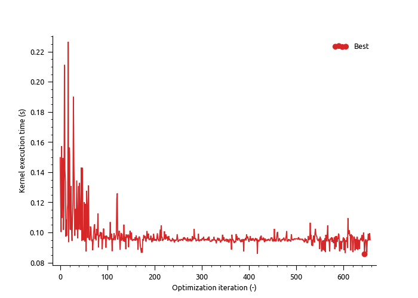

GPU kernel tuning
=================

.. toctree::
   :maxdepth: 2
   :caption: Contents:

To get the maximum performance out of your GPU, the CUDA kernels need to be tuned to find the most optimal settings (e.g. threadblock sizes) for your setup. For this tuning, we use 
`Kernel Launcher <https://github.com/KernelTuner/kernel_launcher>`_ and `Kernel Tuner <https://github.com/KernelTuner/kernel_tuner>`_, both developed by the `Dutch eScience Center (NLeSC) <https://www.esciencecenter.nl/>`_. For more info on GPU kernel tuning, see the `Kernel Tuner reference paper <https://doi.org/10.1016/j.future.2018.08.004>`_.

The tuning consists of two (or three) steps. First, Kernel Launcher captures runtime information from MicroHH, like the kernels (code) that need to be tuned, and the kernel input data and parameters. Second, Kernel Tuner is used to find the most optimal configuration for each kernel. These configurations are appended to a wisdom file, which are used runtime by MicroHH to select the most optimal configuration for the setup and case that you are running.
  
Installation
------------

The Kernel Launcher code is loaded automatically through a Git submodule in ``microhh/external/kernel_launcher``. If that is not the case, try updating all submodules:

.. code-block:: shell

    git submodule update --init --recursive

Kernel Tuner is available through PyPI, and can be installed (together with its dependencies) using:

.. code-block:: shell

    pip install kernel_tuner[cuda]
    # Or to install the requirements manually:
    pip install pycuda cupy scikit-learn scikit-optimize kernel_tuner

Next, you need to configure and compile MicroHH with Kernel Launcher enabled:

.. code-block:: shell

    cmake -DUSESP=true -DUSECUDA=true -DUSEKERNELLAUNCHER=true ..

GPU tuning
----------

To tune a specific model setup, simply run the ``init`` and ``run`` phase as usual, but for the ``run`` phase, you need to specify which kernels you want to tune:

.. code-block:: shell

    # Specify selection of kernels:
    KERNEL_LAUNCHER_TUNE=advec_2i5* ./microhh run drycblles
    # Or simply tune all:
    KERNEL_LAUNCHER_TUNE=* ./microhh run drycblles

Kernel Launcher will provide info about which captures are exported, e.g.:

.. code-block:: shell

    KERNEL_LAUNCHER [INFO] the following kernels will be captured: *
    KERNEL_LAUNCHER [INFO] writing capture to /home/bart/meteo/models/microhh/captures/diff_smag2__calc_strain2_float_128x128x128.json for kernel diff_smag2::calc_strain2@float
    Et cetera.

Once the captures are saved and the time integration starts, you can safely kill MicroHH. A number of captures have now have been written to ``microhh/captures`` in the form of ``.json`` (tuning settings/parameters) and ``.bin`` (input for kernels) files. 

.. warning::

    The captured files include full 3D fields, which are needed as input for the kernels during tuning. As a result, the disk space used by ``captures`` can grow rapidly. After the tuning step below is finished, the ``.json`` and ``.bin`` files can safely be deleted to free disk space.

To tune the code, run the ``tune.py`` script in ``microhh/tuner``:

.. code-block:: shell

    # Tune selection of captures:
    python tune.py ../captures/*128x128x128.json --time=30:00
    # Or simply tune all:
    python tune.py ../captures/*.json --iterations=250

As you can see, there are different methods for specifying how much time Kernel Tuner should spend tuning each kernel. After tuning, the most optimal configurations for your specific setup are appended to the wisdom files in ``microhh/wisdom/``. For each kernel (with settings name ``captures/kernel_name.json`` in this example), the individual timings are written to ``captures/kernel_name.cache.json``, and can be visualised with ``microhh/tuner/plot_cache.py``.

In its default configuration, ``tune.py`` uses a Bayesian optimization strategy to find the most optimal configuration. As shown in the figure below -- which shows the timings of tuning the `advec_2i5` scheme for one hour -- Kernel Tuner manages to find a reasonably optimal configuration fairly quickly, although finding the absolute fastest configuration took almost one hour.

Using the wisdom files
----------------------

During the ``run`` phase, MicroHH / Kernel Launcher reads the wisdom files, and selects the best configuration. Unless the *exact* configuration is available in the wisdom files, Kernel Tuner will inform you which configuration it selected, for example:

.. code-block:: shell

    KERNEL_LAUNCHER [INFO] no wisdom found for kernel "diff_smag2::calc_strain2@float",
    device "NVIDIA RTX A5000", and problem size (64, 64, 128),
    using configuration for different problem size: (128, 128, 128).

Note that Kernel Launcher will always pick one configuration, even if it might not be optimal for your setup or GPU:

.. code-block:: shell

    KERNEL_LAUNCHER [WARN] no wisdom found for kernel "diff_smag2::calc_strain2@float"
    and device "NVIDIA GeForce RTX 2060 SUPER",
    using configuration for different device "NVIDIA RTX A5000".

Tuning all tunable kernels
--------------------------

Exporting the captures for all available (tunable) kernels, and a variety of grid sizes, can be a tedious task. The ``drycblles_tuner.py`` script in the ``drycblles`` case simplifies this task by automatically running the model in various configurations, such that all tunable kernels are captured.

Debugging
---------

To get more info out of Kernel Launcher, run the model with:

.. code-block:: shell

    KERNEL_LAUNCHER_LOG=debug ./microhh run drycblles
